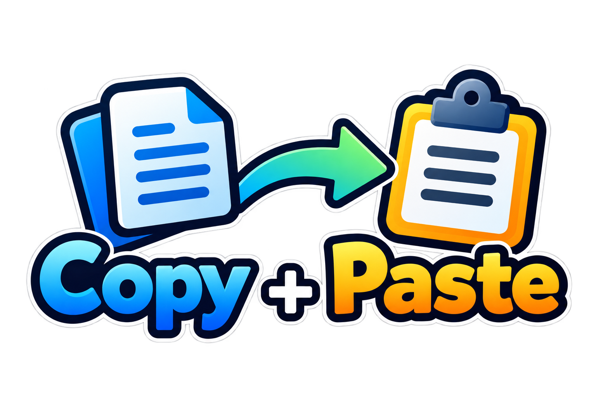

  

# 🕊️ Copy & Paste Freedom

A tiny browser extension (Chrome, Edge, Brave, and other Chromium browsers)
that re-enables **copy, cut, paste, text selection, select-all and right-click**
on websites that block them.

One toggle. Total freedom.

---

## Install (60 seconds)

1. Open your browser's extensions page:
   - Chrome: type `chrome://extensions` in the address bar
   - Edge: type `edge://extensions`
2. Turn on **Developer mode** (toggle in the top-right corner).
3. Click **Load unpacked**.
4. Select this folder: `D:\Copy Past Extension`.
5. (Recommended) Click the puzzle-piece icon in the toolbar and **pin**
   **Copy & Paste Freedom** so the toggle is always one click away.

## Use it

- Click the extension icon → flip the big switch.
  - **ON** (green badge): copy, paste, selection and right-click work everywhere.
  - **OFF** (gray badge): pages behave exactly like normal — nothing is touched.
- Or just press **Ctrl+Shift+U** anywhere to flip it without opening the popup.
- The toggle works **live**: pages pick it up instantly, no refresh needed.
  (If a page still misbehaves, use the "Reload this page" button in the popup.)

## Test it right now

1. Double-click **`test-page.html`** in this folder — it's a simulated
   "hostile" website that blocks everything.
2. With the extension **OFF**, try selecting its text / right-clicking /
   pasting into its box → you'll see red 🚫 toasts.
3. Toggle the extension **ON** (or Ctrl+Shift+U) and try again → everything works.

> If toggling doesn't affect the test page: go to `chrome://extensions` →
> **Copy & Paste Freedom** → **Details** → turn on **Allow access to file URLs**.
> (Regular websites don't need this — it's only for local `file://` pages.)

## How it works (the short version)

Sites block you with JavaScript event traps (`copy`, `paste`, `contextmenu`,
`selectstart`, … that call `preventDefault()`), keyboard traps on
Ctrl+C/X/V/A, CSS `user-select: none`, and — the sneaky ones — scripts that
*let* the paste happen and then immediately revert it by watching for
`insertFromPaste` input events.

This extension injects a small script **before any page script runs** that
intercepts those events at the very first stage of their journey (capture
phase on `window`) and stops them from ever reaching the site's handlers,
while still letting the browser perform the *real* copy/paste. It also
overrides the `user-select: none` CSS.

Paste gets the heavy-duty treatment: the extension reads the clipboard text
straight out of the paste event and inserts it **as if you had typed it**
(the exact same code path real keystrokes take). That means:

- paste-reverting scripts see nothing to revert,
- React/Vue/Angular forms update exactly like normal typing,
- custom web editors accept it like typed text,
- and it also works inside sandboxed `blob:`/`data:` iframes that other
  extensions never reach.

Smart details:

- Only clipboard-related events are intercepted. Normal typing, buttons,
  menus and site shortcuts keep working.
- While OFF, the extension does absolutely nothing.

## Updating to a new version

After getting new files, go to `chrome://extensions`, find
**Copy & Paste Freedom** and click the **reload (↻)** icon on its card,
then refresh the page you're working in.

## Honest limitations

- Extensions can't run on browser-internal pages (`chrome://`, the Chrome
  Web Store, etc.).
- With the toggle ON, pasted text is inserted as plain text (no fancy
  formatting from the clipboard) — this is what makes paste unblockable.
- A rare site that blocks selection via `mousedown` tricks may still resist.
- If you toggle ON while using a web app that runs its *own* custom clipboard
  logic (e.g. Google Docs-style canvas apps), that app may act oddly — just
  flip the toggle OFF there.

## Files

| File | What it is |
|---|---|
| `manifest.json` | Extension manifest (Manifest V3) |
| `content.js` | The unblocker — runs inside every page |
| `background.js` | Keeps state, paints the ON/OFF badge, keyboard shortcut |
| `popup.html/css/js` | The toolbar popup with the big toggle |
| `icons/` | Toolbar/store icons (regenerate with `node tools/make-icons.js`) |
| `test-page.html` | Hostile-site simulator for testing |
| `tools/make-icons.js` | Icon generator script |
